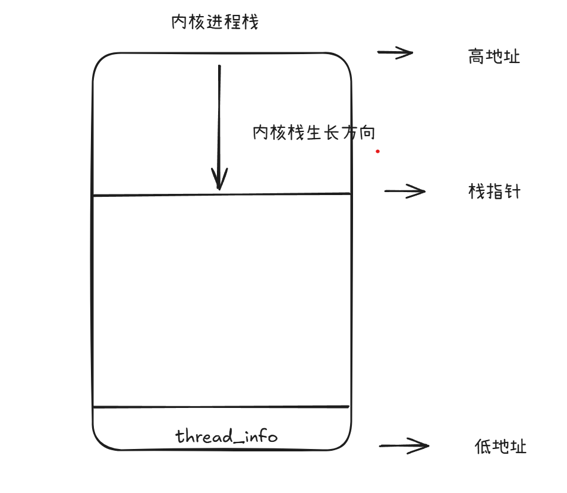
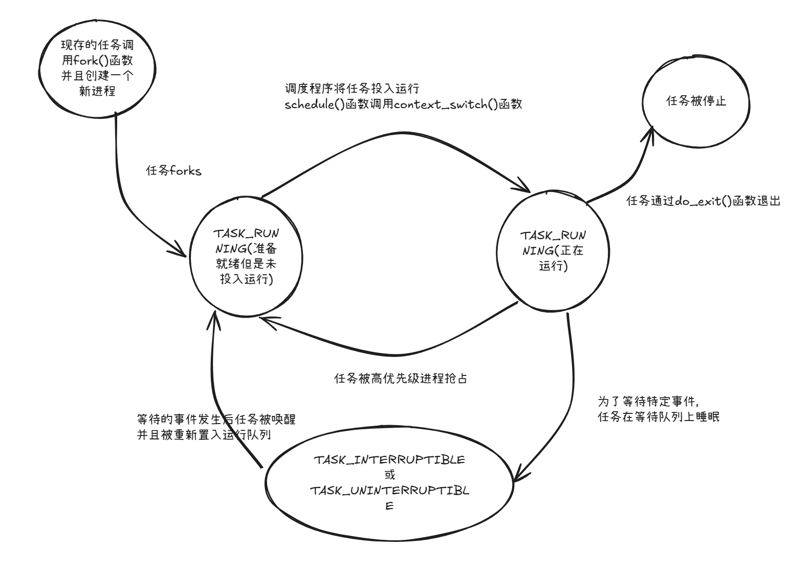

# 进程

进程就是处于执行期的程序，但不仅仅局限于一段可执行的程序代码，通常进程还要包含其他资源，如打开的文件，挂起的信号，内核内部数据，处理器状态，一个或多个具有内存映射的内存地址空间及一个或多个执行线程，还有用来存放全局变量的数据段。

执行线程，简称线程，是进程中活动的对象。每个线程都拥有一个独立的程序计数器、进程栈和一组进程寄存器。内核调度的对象是线程，而不是进程。linux系统的线程实现非常特别：它对线程和进程并不特区分。

进程提供两种虚拟机制：虚拟处理器和虚拟内存。虽然实际上可能有许多进程正在共享一个处理器，但是虚拟处理器给进程一种假象，让这些进程觉得自己在独享处理器。而虚拟内存让进程在分配和管理内存时觉得自己拥有整个系统的所有内存资源。

在linux中，创建新进程通常是调用fork系统调用的结果，这通常是由clone系统调用实现的。如果是为了立即执行新的不同的程序，会接着调用exec这组函数，创建新的地址空间，并把新的程序载入其中。

# 进程描述符及任务结构

内核把进程的列表放在叫做任务队列的双向循环链表中，链表中的每一项都是类型为task_struct的结构中。<linux/sched.h>

task_struct能完整地描述一个正在执行的程序：打开的文件，进程的地址空间，挂起的信号...

## 分配进程描述符

linux通过slab分配器分配tast_struct结构，这样能达到对象复用和缓存着色的目的(通过预先分配和重复使用task_struct，可以避免动态分配和释放带来的资源消耗)。由于现在用slab分配器动态生成task_struct，所以linux在栈顶或者栈底有一个新的结构
struct thread_info。每个任务的thread_info在它的内核栈的尾端分配，结构中task域存放的是指向task_struct的指针。



## 进程描述符的存放

内核通过一个唯一的进程标识值或PID来标识每个进程。内核把每个进程的PID存放在它们各自的进程描述符中。

PID的默认最大值为32768，这是为了和老版本兼容，可以通过/proc/sys/kernel/pid_max来提高上限。

在内核中，访问任务通常需要获取指向其task_strcut的指针。实际上，内核中大部分处理进程的代码都是直接通过task_struct进行的。因此，
通过current宏查找当前正在运行的进程描述符的速度就显得尤为重要。硬件体系结构不同，该宏的实现也就不同，它必须针对专门的硬件处理。
有的硬件体系结构可以拿出一个专门的寄存器来存放指向当前进程task_struct的指针，用于加快访问速度。而像x86这样的体系结构就只能在
内核栈的尾端创建thread_info结构，通过计算偏移间接地查找到task_struct结构。

在x86系统上，current把栈指针的后13个有效位屏蔽掉，用来计算出thread_info的偏移，linux是通过current_thread_info()函数完成的。

```s
// movl操作32位数，-8192就是0xffff2000
movl $-8192, %eax
// 相与屏蔽后13个有效位
addl %esp, %eax
```

最后，current再从thread_info的task域中提取并返回task_struct的地址：current_thread_info()->task;

## 进程状态

进程描述符中的state描述了进程的当前状态。系统中的每个进程都必然处于五种进程状态的一种。该域的值也必为下列五种状态标志之一：

- TASK_RUNNING(运行) —— 进程是可执行的：它或者正在运行，或者在运行队列中等待执行。这是进程在用户空间中执行的唯一可能的状态；这种状态也可以应用到正在内核空间中执行的进程。
- TASK_INTERRUPTIBLE(可中断) —— 进程正在睡眠(也就是说它被阻塞)，等待某些条件的达成。一旦这些条件达成，内核就会把进程的状态设置为运行。处于此状态的进程也会因为接受到信号而提前被唤醒并随时准备投入运行。
- TASK_UNINTERRUPTIBLE(不可中断) —— 除了就算收到信号也不会被唤醒或准备投入运行外，这个状态与可打断状态相同。这个状态通常在进程必须在等待时不受干扰或者等待事件很快就会发生时出现。由于处于此状态的任务对信号不做响应(这就是你在执行ps命令时，看到那些被标记为D状态而又不能被杀死的进程的原因)，所以较之可中断状态，使用的较少。
- __TASK_TRACED —— 被其他进程跟踪的进程，例如通过ptrace对调试程序进行跟踪。
- __TASK_STOPPED —— 进程停止执行；进程没有投入运行也不能投入运行，通常这种状态发生在接收到信号SIGSTOP、SIGTSTP、SIGTTIN、SIGTTOU等信号的时候。此外，在调试期间接收到任何信号，都会使进程进入这种状态。



### 设置当前进程状态

内核通常需要调整某个进程的状态。这时最好使用set_task_state函数。

该函数将指定的进程设置为指定的状态。必要的时候，他会设置内存屏障来强制其他处理器作重新排序。

### 进程上下文

可执行程序代码是进程的重要组成部分。这些代码从一个可执行文件载入到进程的地址空间执行，一般程序在用户空间执行。当一个程序执行了系统调用，或者触发了某个异常，它就陷入了内核空间。此时，我们称内核代表进程执行并处于进程上下文中。在此上下文中current宏是有效的，除非在此间隙有更高优先级的进程需要执行并由调度器做出了相应调整，否则在内核退出的时候，程序恢复在用户空间会继续执行。

系统调用和异常处理程序是内核明确定义的接口。进程只有通过这些接口才能陷入内核执行。

### 进程家族树

所有的进程都是PID为1的init进程的后代。内核在系统启动的最后阶段启动init进程。该进程读取系统的初始化脚本(initscript)并执行其他的相关程序，最终完成系统启动的整个过程。

系统中的每个进程必有一个父进程，相应的，每个进程也可以拥有零个或者多个子进程。拥有同一个父进程的所有进程被称为兄弟。进程的关系存放在进程描述符中。每个task_struct都包含指向其父进程叫做parent的指针，还包含一个称为children的子进程链表。

## 进程创建

unix的进程创建很特别。首先通过fork拷贝当前进程创建一个子进程。子进程与父进程的区别仅仅在于PID、PPID和某些资源的统计量(比如挂起的信号，它没有必要被继承)。然后通过exec读取可执行文件并将其加载到地址空间开始运行。

### 写时拷贝

传统的fork系统调用直接把所有的资源复制给新创建的进程。这种实现过于简单并且效率低下，因为它拷贝的数据也许并不共享，更糟糕的情况是，如果新的进程打算立即执行一个新的程序，那么所有的拷贝都前功尽弃。Linux的fork使用写时拷贝页实现。写时拷贝是一种可以推迟甚至免除拷贝数据的技术。内核此时并不复制整个进程地址空间，而是让父进程和子进程共享同一个拷贝。

只有在需要写入的时候，数据才会被复制，从而使各个进程拥有各自的拷贝。fork的实际开销就是复制父进程的页表以及给子进程创建唯一的进程描述符。

### fork

linux通过clone系统调用实现fork。这个调用通过一系列的参数标志指明父子进程之间需要共享的资源。fork、vfork和__clone函数都根据各自需要的参数标志调用clone，然后由clone调用do_fork。

do_fork完成了创建中的大部分工作，它的定义在kernel/fork.c中。该函数调用copy_process函数，然后让进程开始运行。

```c
// kernel/fork.c: copy_process
static task_t *copy_process(unsigned long clone_flags,
				 unsigned long stack_start,
				 struct pt_regs *regs,
				 unsigned long stack_size,
				 int __user *parent_tidptr,
				 int __user *child_tidptr,
				 int pid)
{
  ...
  // 为新进程创建一个内核栈、thread_info结构和task_struct，大部分数据保持相同
  p = dup_task_struct(current, node);
  ...
  // 检查并确保新创建这个子进程后，当前用户所拥有的进程数目没有超过给它分配的资源的限制
	if (atomic_read(&p->real_cred->user->processes) >=
			task_rlimit(p, RLIMIT_NPROC)) {
		if (!capable(CAP_SYS_ADMIN) && !capable(CAP_SYS_RESOURCE) &&
		    p->real_cred->user != INIT_USER)
			goto bad_fork_free;
	}
  // 子进程使自己父进程区分开来。进程描述符内的许多成员被清0或者设为初始值。那些不是继承来的进程描述符成员
  // 主要是统计信息

  // 更新task_struct的flags成员。表明进程是否拥有超级用户权限的PF_SUPERPRIV标志被清0。表明进程还没有调用exec函数的
  // PF_FORKNOEXEC标志被设置
	copy_flags(clone_flags, p);

  // 根据传递给clone的参数标志，copy_process拷贝或共享打开的文件、文件系统信息、信号处理函数、进程地址空间等

  // 调用alloc_pid为新进程分配一个有效的PID
	if (pid != &init_struct_pid) {
		retval = -ENOMEM;
		pid = alloc_pid(p->nsproxy->pid_ns);
		if (!pid)
			goto bad_fork_cleanup_io;

		if (clone_flags & CLONE_NEWPID) {
			retval = pid_ns_prepare_proc(p->nsproxy->pid_ns);
			if (retval < 0)
				goto bad_fork_free_pid;
		}
	}
  ...
}

```

回到do_fork函数，新创建的子进程被唤醒并让其投入运行。内核有意选择了子进程首先运行。因为一般子进程都会马上调用exec函数，这样可以避免写时拷贝的额外开销，如果父进程首先执行的话，有可能会开始向地址空间写入。

# 线程在linux中的实现

linux实现线程的机制非常独特。从内核的角度来说，它没有线程这个概念。linux把所有的线程当作进程来处理，内核并没有准备特别的调度算法或是特别数据结构来表现线程。相反，线程仅仅被视为一个与其他进程共享某些资源的进程。每个线程都有唯一隶属于自己的task_struct。

## 创建线程

线程的创建和普通进程的创建类似，只不过在调用clone的时候需要传递一些参数标志来指明需要共享的资源。
```c
clone(CLONE_VM | CLONE_FS | CLONE_FILES | CLONE_SIGHND, 0);
```

上面的代码产生的结果和调用fork差不多，只是父子俩共享地址空间、文件系统资源、文件描述符和信号处理函数。

对比一下，一个普通的fork的实现是：
```c
clone(SIGCHLD, 0);
```

传递给clone的参数标志决定了新创建进程的行为方式和父子进程之间共享的资源种类。下面是在<linux/sched.h>中的定义。

| 参数标志             | 含义                                            |
| -------------------- | ----------------------------------------------- |
| CLONE_FILES          | 父子进程共享打开的文件                          |
| CLONE_FS             | 父子进程共享文件系统信息                        |
| CLONE_IDLETASK       | 将PID设置为0(只供idle进程使用)                  |
| CLONE_NEWNS          | 为子进程创建新的命名空间                        |
| CLONE_PARENT         | 指定子进程和父进程拥有同一个父进程              |
| CLONE_PTRACE         | 继续调试子进程                                  |
| CLONE_SETTID         | 将TID回写至用户空间                             |
| CLONE_SETTLS         | 为子进程创建新的TLS                             |
| CLONE_SIGHAND        | 父子进程共享信号处理函数及被阻断的信号          |
| CLONE_SYSVSEM        | 父子进程共享System V SEM_UNDO语义               |
| CLONE_THREAD         | 父子进程放入相同的线程组                        |
| CLONE_VFORK          | 调用vfork，所以父进程准备睡眠等待子进程将其唤醒 |
| CLONE_UNTRACED       | 防止跟踪进程在子进程上强制执行CLONE_PTRACE      |
| CLONE_STOP           | 以TASK_STOPPED状态开始进程                      |
| CLONE_SETTLS         | 为子进程创建新的TLS                             |
| CLONE_CHILD_CLEARTID | 清除子进程的TID                                 |
| CLONE_CHILD_SETTID   | 设置子进程的TID                                 |
| CLONE_PARENT_SETTID  | 设置父进程的TID                                 |
| CLONE_VM             | 父子进程共享地址空间                            |

## 内核线程

内核通常需要在后台执行一些操作。这种任务可以通过内核线程完成——独立运行在内核空间的标准进程。内核线程和普通的进程间的区别在于内核线程没有独立的地址空间（实际上指向地址空间的mm指针被设置为NULL）。它们只在内核空间运行，从来不切换到用户空间去。内核进程和普通进程一样，可以被调度，也可以被抢占。

linux确实会把一些任务交给内核线程去做，想flush和ksoftirq这些任务就是明显的例子。这些线程在系统启动时由另外一些内核线程创建。实际上内核线程也只能由其他内核线程创建。内核是通过从kthreadd内核线程中衍生出所有新的内核线程来自动处理这一点的。在<linux/kthread.h>中申明有接口kthread_create。新创建的进程处于不可运行状态，如果不通过调用wake_up_process明确地唤醒它，他不会主动运行。创建一个线程让它运行起来，可以通过调用kthread_run来达到。

内核线程启动后就一直运行直到调用do_exit退出，或者内核的其他部分调用kthread_stop退出。

# 进程终结

当一个进程终结时，内核必须释放它所占有的资源并将消息告诉其父进程。

一般来说，进程的销毁是自身引起的。它发生在进程调用exit系统调用时，既可能显示地调用这个系统调用，也可能隐式地从某个程序的主函数返回（C语言编译器会在main函数的返回点后放置exit）。当进程接受到它既不能处理也不能忽略的信号或者异常时，它还可能被动地终结。不管进程是怎么终结地，该任务大部分都要靠do_exit来完成。

1. 将task_struct中的标志设置为PF_EXITING
2. 调用del_timer_sync删除任一内核定时器。根据返回的结果，它确保没有定时器在排队，也没有定时器处理程序在运行
3. 如果BSD的进程记账功能是开启的，do_exit调用acct_update_integrals来输出记账信息。
4. 调用exit_mm函数释放进程占用的mm_struct，如果没有别的进程使用它们，就彻底释放它们
5. 接下来调用sem__exit函数。如果进程等候IPC信号，它则离开队列
6. 调用exit_files和exit_fs，以分别递减文件描述符、文件系统数据的引用计数。如果其中某个引用计数的数值降低为零，那么就代表没有进程在使用相应的资源，此时可以释放。
7. 接着把存在task_struct的exit_code中的任务退出代码置为由exit提供的退出代码，或者去完成任何其他由内核机制规定的退出动作。退出代码存放在这里供父进程随时检索。
8. 调用exit_notify向父进程发送信号，给子进程重新找养父，养父为线程组中的其他线程或者为init进程，并把进程状态设置为EXIT_ZOMBIE
9. do_exit调用schedule切换到新的进程。因为处于EXIT_ZOMBIE状态的进程不会在调度，所以这是进程所执行的最后一段代码。do_exit永不返回

至此，与进程相关联的所有资源都被释放掉了。它占用的所有内存就是内核栈、thread_info结构和task_struct结构。此时进程存在的唯一目的就是向它的父进程提供信息。父进程检索到信息后，或者通知内核那是无关的信息后，由进程所持有的剩余内存被释放，归还给系统使用。

## 删除进程描述符

wait这一族函数都是通过唯一的一个系统调用wait4来实现的。它的标准动作是挂起调用它的线程，直到其中一个子进程退出，此时函数会返回该子进程的PID。此外调用该函数时提供的指针会包含子进程退出时的退出代码。

当最终需要释放进程描述符时，release_task会被调用，用以完成以下工作。

1. 调用__exit_signal，该函数调用_unhash_process，后者又调用detach_pid从pidhash中删除该进程，同时也从任务列表中删除该进程。
2. __exit_signal释放目前将死进程所使用的所有剩余资源，并进行最终统计和记录。
3. 如果这个进程是进程组最后一个进程，并且领头进程已经死掉，那么release_task就要通知僵死的领头进程的父进程。
4. 调用put_task_struct释放进程内核栈和thread_info结构所占的页，并释放task_struct所占用的slab高速缓存。

至此，进程描述符和所有进程独享的资源就全部释放掉。

## 孤儿进程造成的进退维谷

如果父进程在子进程之前退出，必须有机制保证子进程能找到一个新的父亲，否则这些作为孤儿的进程就会在退出时永远处于僵死状态，白白地耗费内存。对于这个问题，解决方法是给子进程在当前进程组内找一个线程作为父亲，如果不行，就把init做它们的父进程。在do_exit中会调用exit_notify，该函数会调用foget_original_parent，而后者会调用find_new_reaper来执行寻找父进程。

一旦系统为进程成功地找到和设置了新地父进程，就不会再有出现驻留僵死进程的危险了，init进程会例行调用wait来检查子进程，清除所有与其相关的僵尸进程。
