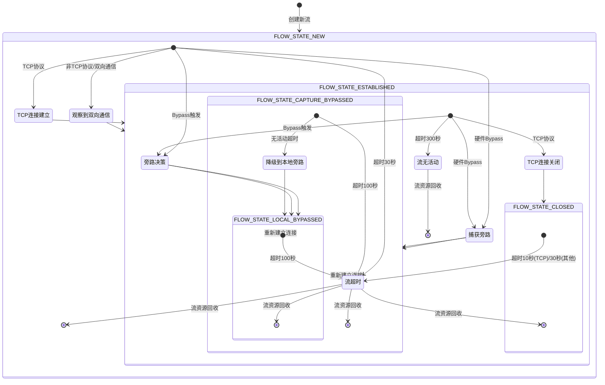

# Suricata Flow状态机详细分析

## 概述

Suricata中的Flow状态机是网络流量处理的核心机制，它跟踪和管理网络连接的整个生命周期。本文档详细描述了Flow状态机的各个状态、状态转换条件以及相关处理逻辑。

## 1. 状态定义

Suricata中的Flow状态定义在`src/flow.h`中：

```c
enum FlowState {
    FLOW_STATE_NEW = 0,           // 新建流
    FLOW_STATE_ESTABLISHED,        // 已建立流
    FLOW_STATE_CLOSED,             // 已关闭流
    FLOW_STATE_LOCAL_BYPASSED,     // 本地旁路流
#ifdef CAPTURE_OFFLOAD
    FLOW_STATE_CAPTURE_BYPASSED,   // 捕获旁路流
#endif
};
```

### 1.1 FLOW_STATE_NEW（新建状态）

**触发条件：**
- 流首次被创建时
- 在`FlowGetFlowFromHash`函数中，当创建新流时
- 在`FlowGetNew`函数中，当分配新流对象时

**状态特点：**
- 流刚刚被初始化
- 尚未完成双向通信
- 超时时间较短（默认30秒）

**处理行为：**
- 基本的数据包处理
- 等待双向通信的建立

**代码实现：**
```c
// src/flow-hash.c
FlowInit(tv, f, p);
f->flow_hash = hash;
f->fb = fb;
FlowUpdateState(f, FLOW_STATE_NEW);
```

### 1.2 FLOW_STATE_ESTABLISHED（已建立状态）

**触发条件：**
- TCP连接到达ESTABLISHED状态
- 非TCP协议观察到双向通信（客户端到服务器和服务器到客户端）
- TCP连接处于FIN_WAIT1、FIN_WAIT2、CLOSING、CLOSE_WAIT状态

**状态特点：**
- 流已经建立，双向通信已观察到
- 超时时间较长（默认300秒）
- 可能进行深度包检测和应用层协议分析

**处理行为：**
- 完整的应用层协议处理
- 流量统计和行为分析
- 可能的旁路决策

**代码实现：**
```c
// src/stream-tcp.c
switch(ssn->state) {
    case TCP_ESTABLISHED:
    case TCP_FIN_WAIT1:
    case TCP_FIN_WAIT2:
    case TCP_CLOSING:
    case TCP_CLOSE_WAIT:
        FlowUpdateState(p->flow, FLOW_STATE_ESTABLISHED);
        break;
}
```

```c
// src/flow.c
if ((f->flags & (FLOW_TO_DST_SEEN|FLOW_TO_SRC_SEEN)) ==
        (FLOW_TO_DST_SEEN|FLOW_TO_SRC_SEEN)) {
    if (
#ifdef CAPTURE_OFFLOAD
            (f->flow_state != FLOW_STATE_CAPTURE_BYPASSED) &&
#endif
            (f->flow_state != FLOW_STATE_LOCAL_BYPASSED)) {
        FlowUpdateState(f, FLOW_STATE_ESTABLISHED);
    }
}
```

### 1.3 FLOW_STATE_CLOSED（已关闭状态）

**触发条件：**
- TCP连接到达CLOSED状态
- TCP连接处于LAST_ACK、TIME_WAIT状态

**状态特点：**
- 流已经关闭
- 超时时间短（TCP默认10秒）
- 等待资源回收

**处理行为：**
- 流资源清理
- 统计信息更新
- 最终资源回收

**代码实现：**
```c
// src/stream-tcp.c
switch(ssn->state) {
    case TCP_LAST_ACK:
    case TCP_TIME_WAIT:
    case TCP_CLOSED:
        FlowUpdateState(p->flow, FLOW_STATE_CLOSED);
        break;
}
```

### 1.4 FLOW_STATE_LOCAL_BYPASSED（本地旁路状态）

**触发条件：**
- 系统决定旁路处理该流
- 特定触发条件满足（如流特征、策略等）
- 从CAPTURE_BYPASSED降级（当无活动超时）

**状态特点：**
- 流被本地旁路处理，不再进行深度检测
- 超时时间中等（默认100秒）
- 性能优化状态

**处理行为：**
- 绕过深度检测
- 基本流量统计
- 可能的硬件旁路

**代码实现：**
```c
// src/decode.c
void PacketBypassCallback(Packet *p)
{
    if (p->flow) {
        int state = p->flow->flow_state;
        if (state == FLOW_STATE_LOCAL_BYPASSED)
            return;
        FlowUpdateState(p->flow, FLOW_STATE_LOCAL_BYPASSED);
    }
}
```

### 1.5 FLOW_STATE_CAPTURE_BYPASSED（捕获旁路状态）

**触发条件：**
- 硬件旁路功能启用
- 流被硬件标记为旁路处理

**状态特点：**
- 仅在CAPTURE_OFFLOAD启用时存在
- 硬件级别的旁路处理
- 最高性能状态

**处理行为：**
- 最小化处理开销
- 基本流量统计
- 硬件旁路维持

**代码实现：**
```c
// src/decode.c
void PacketBypassCallback(Packet *p)
{
    if (p->flow) {
        FlowUpdateState(p->flow, FLOW_STATE_CAPTURE_BYPASSED);
    }
}
```

```c
// src/flow.c
if (SCTIME_SECS(p->ts) - SCTIME_SECS(f->lastts) >
        flow_timeouts[f->protomap].bypassed_timeout / 2) {
    SCLogDebug("Downgrading flow to local bypass");
    f->lastts = p->ts;
    FlowUpdateState(f, FLOW_STATE_LOCAL_BYPASSED);
}
```

## 2. 状态转换函数

### 2.1 FlowUpdateState函数

```c
// src/flow.c
void FlowUpdateState(Flow *f, const enum FlowState s)
{
    if (s != f->flow_state) {
        /* 设置新状态 */
        // 显式转换枚举类型到紧凑版本
        f->flow_state = (FlowStateType)s;

        /* 更新超时策略和值 */
        const uint32_t timeout_policy = FlowGetTimeoutPolicy(f);
        if (timeout_policy != f->timeout_policy) {
            f->timeout_policy = timeout_policy;
        }
    }
#ifdef UNITTESTS
    if (f->fb != NULL) {
#endif
        /* 重置流桶的next_ts值，使流管理器必须重新检查此行 */
        SC_ATOMIC_SET(f->fb->next_ts, 0);
#ifdef UNITTESTS
    }
#endif
}
```

该函数在状态转换时执行以下操作：
1. 更新流的状态
2. 更新对应的超时策略
3. 通知流管理器重新检查对应的哈希桶

## 3. 状态超时策略

每个状态关联不同的超时策略，在`src/flow-private.h`中定义：

```c
#define FLOW_DEFAULT_NEW_TIMEOUT 30
#define FLOW_DEFAULT_EST_TIMEOUT 300
#define FLOW_DEFAULT_BYPASSED_TIMEOUT 100
#define FLOW_IPPROTO_TCP_NEW_TIMEOUT 30
#define FLOW_IPPROTO_TCP_EST_TIMEOUT 300
#define FLOW_IPPROTO_TCP_CLOSED_TIMEOUT 10
#define FLOW_IPPROTO_TCP_BYPASSED_TIMEOUT 100
```

不同协议有不同的超时值，这些值在状态转换时被应用。

## 4. 状态转换图



## 5. 详细状态转换路径

### 5.1 NEW → ESTABLISHED

**路径1：TCP连接建立**
```c
// src/stream-tcp.c
switch(ssn->state) {
    case TCP_ESTABLISHED:
    case TCP_FIN_WAIT1:
    case TCP_FIN_WAIT2:
    case TCP_CLOSING:
    case TCP_CLOSE_WAIT:
        FlowUpdateState(p->flow, FLOW_STATE_ESTABLISHED);
        break;
}
```

**路径2：非TCP协议的双向通信观察**
```c
// src/flow.c
if ((f->flags & (FLOW_TO_DST_SEEN|FLOW_TO_SRC_SEEN)) ==
        (FLOW_TO_DST_SEEN|FLOW_TO_SRC_SEEN)) {
    if (
#ifdef CAPTURE_OFFLOAD
            (f->flow_state != FLOW_STATE_CAPTURE_BYPASSED) &&
#endif
            (f->flow_state != FLOW_STATE_LOCAL_BYPASSED)) {
        FlowUpdateState(f, FLOW_STATE_ESTABLISHED);
    }
}
```

### 5.2 ESTABLISHED → CLOSED

**触发：TCP连接关闭**
```c
// src/stream-tcp.c
switch(ssn->state) {
    case TCP_LAST_ACK:
    case TCP_TIME_WAIT:
    case TCP_CLOSED:
        FlowUpdateState(p->flow, FLOW_STATE_CLOSED);
        break;
}
```

### 5.3 任意状态 → LOCAL_BYPASSED

**触发：旁路回调**
```c
// src/decode.c
void PacketBypassCallback(Packet *p)
{
    if (p->flow) {
        int state = p->flow->flow_state;
        if (state == FLOW_STATE_LOCAL_BYPASSED)
            return;
        FlowUpdateState(p->flow, FLOW_STATE_LOCAL_BYPASSED);
    }
}
```

### 5.4 任意状态 → CAPTURE_BYPASSED

**触发：捕获旁路回调**
```c
// src/decode.c
void PacketBypassCallback(Packet *p)
{
    if (p->flow) {
        FlowUpdateState(p->flow, FLOW_STATE_CAPTURE_BYPASSED);
    }
}
```

### 5.5 CAPTURE_BYPASSED → LOCAL_BYPASSED

**触发：无活动超时**
```c
// src/flow.c
if (SCTIME_SECS(p->ts) - SCTIME_SECS(f->lastts) >
        flow_timeouts[f->protomap].bypassed_timeout / 2) {
    SCLogDebug("Downgrading flow to local bypass");
    f->lastts = p->ts;
    FlowUpdateState(f, FLOW_STATE_LOCAL_BYPASSED);
}
```

## 6. 状态对Flow管理的影响

### 6.1 超时检查

```c
// src/flow-hash.c
bool StillAlive(Flow *f, SCTime_t ts)
{
    switch (f->flow_state) {
        case FLOW_STATE_NEW:
            if (SCTIME_SECS(ts) - SCTIME_SECS(f->lastts) <= 1)
                return true;
            break;
        case FLOW_STATE_ESTABLISHED:
            if (SCTIME_SECS(ts) - SCTIME_SECS(f->lastts) <= 5)
                return true;
            break;
        case FLOW_STATE_CLOSED:
            if (SCTIME_SECS(ts) - SCTIME_SECS(f->lastts) <= 3)
                return true;
            break;
        // ...
    }
}
```

### 6.2 统计计数

在流结束时，会根据状态更新相应的统计计数器：
```c
// src/flow-util.c
for (int i = 0; i < FLOW_STATE_SIZE; i++) {
    const char *name = NULL;
    if (i == FLOW_STATE_NEW) {
        name = "flow.end.state.new";
    } else if (i == FLOW_STATE_ESTABLISHED) {
        name = "flow.end.state.established";
    } else if (i == FLOW_STATE_CLOSED) {
        name = "flow.end.state.closed";
    } else if (i == FLOW_STATE_LOCAL_BYPASSED) {
        name = "flow.end.state.local_bypassed";
#ifdef CAPTURE_OFFLOAD
    } else if (i == FLOW_STATE_CAPTURE_BYPASSED) {
        name = "flow.end.state.capture_bypassed";
#endif
    }
    // 注册统计计数器...
}
```

### 6.3 处理行为

在FlowWorker中，不同状态有不同的处理逻辑：
```c
// src/flow-worker.c
switch (p->flow->flow_state) {
    case FLOW_STATE_CAPTURE_BYPASSED: {
        StatsAddUI64(tv, fw->both_bypass_pkts, 1);
        StatsAddUI64(tv, fw->both_bypass_bytes, GET_PKT_LEN(p));
        Flow *f = p->flow;
        FlowDeReference(&p->flow);
        FLOWLOCK_UNLOCK(f);
        return TM_ECODE_DONE;
    }
    case FLOW_STATE_LOCAL_BYPASSED: {
        StatsAddUI64(tv, fw->local_bypass_pkts, 1);
        StatsAddUI64(tv, fw->local_bypass_bytes, GET_PKT_LEN(p));
        Flow *f = p->flow;
        FlowDeReference(&p->flow);
        FLOWLOCK_UNLOCK(f);
        return TM_ECODE_DONE;
    }
}
```

## 7. 总结

Suricata的Flow状态机是整个系统处理网络流的核心机制，它：

1. **跟踪流的生命周期**：从创建到关闭的整个过程
2. **影响处理策略**：不同状态有不同的超时值和处理逻辑
3. **支持优化功能**：如Bypass机制依赖于状态转换
4. **影响资源管理**：状态决定流的超时处理和资源回收

FlowUpdateState函数是这个状态机的核心，它不仅更新状态，还负责相关的副作用，如更新超时策略和通知流管理器重新检查对应的哈希桶。

这种设计使得Suricata能够高效地管理网络流，根据流的不同阶段采取不同的处理策略，同时在性能和安全性之间取得平衡。
