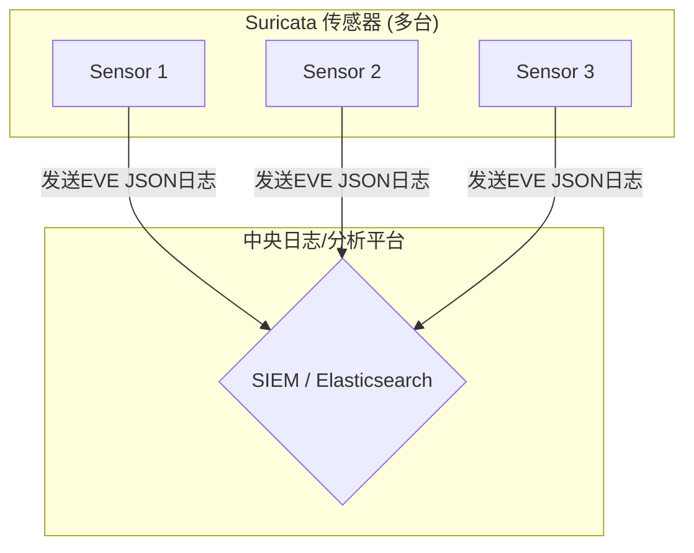

# Suricata功能详解：从IP信誉到中央日志平台

本文档整理了关于Suricata核心功能的一系列问答，涵盖了IP信誉（IP Reputation）机制的原理、部署方法，以及如何与中央日志平台集成以构建现代化的网络安全监控体系。

## 一、什么是IP信誉 (IP Reputation)？

Suricata的IP信誉功能是一种机制，用于根据IP地址的已知“声誉”来识别和处理网络流量。

简单来说，您可以创建一个或多个IP地址列表（黑名单），这些IP地址因从事恶意活动（如垃圾邮件、扫描、僵尸网络命令和控制等）而闻名。然后，您可以配置Suricata，使其在看到来自或去往这些IP地址的流量时，自动生成警报或直接丢弃数据包。

这是一种非常高效的检测方式，因为它不需要对数据包内容进行深度分析，只需匹配IP地址即可快速做出响应。

## 二、如何部署IP信誉功能？

部署IP信誉功能通常涉及三个核心部分：**IP信誉列表文件**、**Suricata配置文件** 和 **检测规则**。

### 部署图示

```mermaid
graph TD
    subgraph "步骤 1: 准备IP信誉列表"
        A[IP黑名单文件<br/>(black.list)]
        A -- "包含恶意IP, e.g., 192.0.2.1" --> B
    end

    subgraph "步骤 2: 配置Suricata"
        B[suricata.yaml]
        B -- "reputation-files:<br/>  - black.list" --> C
    end

    subgraph "步骤 3: 编写规则"
        C[规则文件<br/>(local.rules)]
        C -- "iprep:any,any,>,0;" --> D
    end

    subgraph "步骤 4: 检测与告警"
        E[网络流量<br/>(来自 192.0.2.1)]
        F[Suricata引擎]
        G[告警日志<br/>(eve.json/fast.log)]
        E --> F
        D -- "应用规则" --> F
        F -- "匹配成功" --> G
    end

    A -- "加载列表" --> F
```

### 详细部署步骤

#### 步骤 1: 创建IP信誉列表文件

首先，您需要一个包含“坏”IP地址的文本文件。每个IP地址或CIDR网段占一行。

例如，一个名为 `black.list` 的文件内容如下：
```
# 示例恶意IP地址列表
192.0.2.1
198.51.100.0/24
203.0.113.55
```

#### 步骤 2: 修改Suricata配置文件

接下来，在主配置文件 `suricata.yaml` 中告诉Suricata加载这个IP列表。

找到 `reputation:` 部分，并添加您的文件名：
```yaml
# suricata.yaml

reputation:
  # 设置为yes来启用信誉加载和iprep关键字
  enabled: yes

  # 要加载的IP信誉文件的列表
  files:
    - black.list
```
**说明**:
- `enabled: yes` 开启了IP信誉功能。
- `files:` 列表下指定了要加载的 `black.list` 文件。

#### 步骤 3: 编写使用IP信誉的规则

创建一个规则来使用加载的IP信誉数据。`iprep` 是专门用于此目的的规则关键字。此规则可以添加到您的规则文件（例如 `rules/local.rules`）中：

```
alert ip any any -> any any (msg:"IPREP: Detected traffic from/to blacklisted IP"; iprep:any,any,>,0; classtype:bad-unknown; sid:1000001; rev:1;)
```
**规则解释**:
- `iprep:any,any,>,0`: 如果数据包的源IP或目的IP（第一个`any`）存在于任何已加载的信誉列表（第二个`any`）中，则条件匹配。

#### 步骤 4: 启动并验证

使用您的配置启动Suricata。当来自或去往 `black.list` 中IP的流量经过时，Suricata将在告警日志（`fast.log` 或 `eve.json`）中生成记录。

---

## 三、Suricata如何与其他机器交互？

Suricata生态系统中的工具及其输出格式支持与其他机器进行丰富的交互，主要体现在两个方面。

### 1. 自动更新威胁情报：`suricata-update`

在生产环境中，手动维护IP列表效率低下。官方工具 `suricata-update` 可用于自动从互联网上的威胁情报源下载和更新规则及IP信誉列表。

**交互图示:**
```mermaid
graph TD
    A[威胁情报提供商<br/>(例如 Emerging Threats, OISF)]
    B(suricata-update 工具)
    C[您的Suricata服务器]

    A -- "1. 定期提供最新的<br/>规则和IP黑名单" --> B
    B -- "2. 下载并处理<br/>(可设置每天自动执行)" --> C
    C -- "3. 加载最新的情报<br/>进行网络检测" --> C
```
通过 `suricata-update` 工具，您可以轻松订阅并启用公开的黑名单源，实现威胁情报的自动化管理。

### 2. 与中央日志服务器交互

Suricata可以将告警和事件以结构化的 `EVE JSON` 格式输出。这种格式非常适合被其他机器（如SIEM平台、日志管理系统）收集和分析。

**交互图示:**


---

## 四、为何要将日志推送到中央平台？

将告警日志“推送”到中央服务器，是 **集中化管理、关联分析和长期存储** 的关键，极大地提升了安全监控的效率和深度。

您可以把每一台Suricata想象成一个在街上巡逻的警察。“推送”日志，就等于要求每个警察都必须把发现的所有情况实时汇报给指挥中心。

### 核心优势
1.  **全局视野 (Centralized Visibility)**: 在一个屏幕上监控所有网络安全事件，无需登录单台机器。
2.  **关联分析 (Correlation Analysis)**: 识别跨越多个节点的大规模、有组织的攻击活动，还原完整攻击链。
3.  **长期存储与安全审计 (Long-Term Storage & Forensics)**: 实现日志的长期保存，满足安全审计和事件回溯的需求。
4.  **强大的可视化与报告 (Powerful Visualization & Reporting)**: 利用专业工具将日志数据转化为直观的图表和仪表盘，洞察安全趋势。
5.  **增强的告警与自动化响应 (Advanced Alerting & Automation)**: 基于关联分析结果创建更复杂的告警，并可联动其他设备（如防火墙）实现自动化响应（SOAR）。

---

## 五、中央日志平台的实现方案示例

构建这种中央平台的方案非常成熟，其中最著名、使用最广泛的是 **Elastic Stack (通常称为 ELK Stack)**。

### 主流实现方案: The Elastic Stack (ELK)

这是一套开源组合，包括：
- **Elasticsearch**: 存储和索引日志数据的核心。
- **Kibana**: 用于数据查询、可视化和仪表盘制作的Web界面。
- **Filebeat**: 安装在Suricata服务器上的轻量级代理，负责读取并推送日志。

#### 架构示例图
```mermaid
graph TD
    subgraph "您的Suricata服务器"
        A[Suricata引擎] --"生成告警"--> B(eve.json 文件)
        C[Filebeat] --"读取并推送"--> B
    end

    subgraph "中央日志平台 (Elastic Stack)"
        D[Elasticsearch<br/>(存储与索引)]
        E[Kibana<br/>(可视化与分析)]
    end

    C --"将JSON日志<br/>发送到"--> D
    E --"查询数据<br/>用于展示"--> D
```

### 其他流行方案
1.  **Wazuh (强烈推荐)**: 一个基于Elastic Stack构建的、开箱即用的开源安全平台（SIEM & XDR）。它已经预置了Suricata的集成规则、解码器和仪表盘，是快速搭建专业安全监控系统的最佳选择。
2.  **Splunk**: 功能强大的商业日志分析平台，业界领导者之一，但价格昂贵。
3.  **Graylog**: 另一个流行的开源日志管理平台，是ELK和Splunk的有力竞争者。

### 建议
- **快速入门**: 选择 **Wazuh**，它省去了大量配置和集成的麻烦。
- **高度定制化**: 选择 **Elastic Stack (ELK)**，灵活性最高。
- **预算充足的企业**: 可以考虑 **Splunk**。
