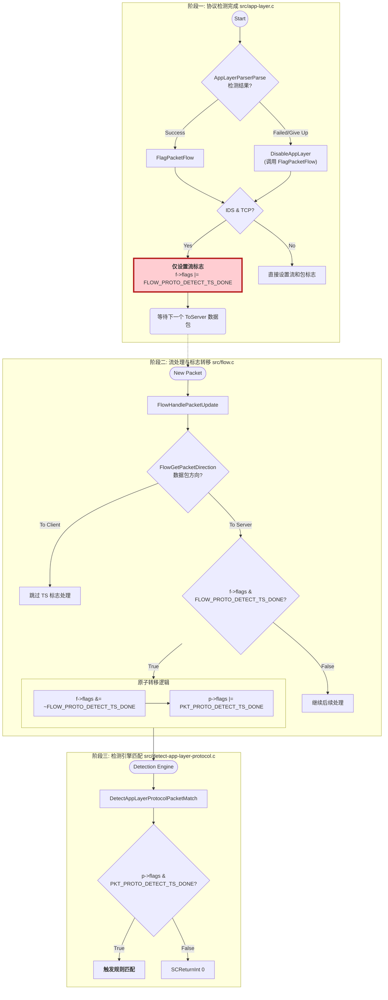

## Suricata 中 `PKT_PROTO_DETECT_TS_DONE` 和 `FLOW_PROTO_DETECT_TS_DONE` 的作用分析

在 Suricata 中，`PKT_PROTO_DETECT_TS_DONE` 和 `FLOW_PROTO_DETECT_TS_DONE` 是两个密切相关的标志位，用于指示应用层协议检测（AppLayer Protocol Detection）在 **To Server (TS)** 方向上的完成状态。

它们的主要作用是协调协议检测逻辑与检测引擎（Detection Engine）规则匹配之间的时序，特别是在处理 TCP 流和 IDS 模式下的异步情况。

### 1. 定义与位置

*   **`FLOW_PROTO_DETECT_TS_DONE`**
    *   **定义位置**: `src/flow.h` (`BIT_U32(22)`)
    *   **作用对象**: `Flow` 结构体（流）。
    *   **含义**: 标记该**流**在“客户端到服务器”（To Server）方向上的应用层协议检测已经完成。

*   **`PKT_PROTO_DETECT_TS_DONE`**
    *   **定义位置**: `src/decode.h` (`BIT_U32(23)`)
    *   **作用对象**: `Packet` 结构体（数据包）。
    *   **含义**: 标记当前**数据包**是协议检测完成后的触发点。检测引擎会检查这个标志来决定是否匹配特定的应用层协议规则。

### 2. 核心机制与交互流程

这两个标志位通过“**流状态暂存 -> 数据包触发**”的机制协同工作，主要逻辑在 `src/app-layer.c` 和 `src/flow.c` 中实现。

#### A. 设置标志 (`src/app-layer.c`)
在 `FlagPacketFlow` 函数中，当应用层协议被识别后：
*   **IPS 模式或非 TCP 协议**: 直接同时设置 Flow 和 Packet 的标志位。
*   **IDS 模式且为 TCP**:
    *   协议检测通常发生在收到 ACK 时（可能是在相反方向的数据包上）。为了确保规则匹配发生在正确方向的数据包上，代码会**只设置 Flow 标志** (`FLOW_PROTO_DETECT_TS_DONE`)。
    *   这相当于把“检测完成”这个状态挂起，等待下一个流向服务器的数据包。

```c
/* src/app-layer.c 部分逻辑简化 */
if (p->proto != IPPROTO_TCP || EngineModeIsIPS()) {
    // IPS 或 非TCP：立即生效
    p->flags |= PKT_PROTO_DETECT_TS_DONE;
    f->flags |= FLOW_PROTO_DETECT_TS_DONE;
} else {
    // IDS TCP：暂存状态到 Flow
    if (flags & STREAM_TOSERVER) {
        f->flags |= FLOW_PROTO_DETECT_TS_DONE;
    }
    // ...
}
```

#### B. 传递标志 (`src/flow.c`)
在流处理逻辑中，当遇到一个去往服务器（To Server）的数据包时，如果发现流上挂着 `FLOW_PROTO_DETECT_TS_DONE` 标志，就会将其“转移”到当前数据包上：

```c
/* src/flow.c 部分逻辑 */
if (pkt_dir == TOSERVER) {
    // ...
    /* 将协议检测完成标志转移给该方向的第一个数据包 */
    if (f->flags & FLOW_PROTO_DETECT_TS_DONE) {
        f->flags &= ~FLOW_PROTO_DETECT_TS_DONE; // 关键：清除流标志
        p->flags |= PKT_PROTO_DETECT_TS_DONE;   // 设置包标志
    }
    // ...
}
```

#### C. 触发检测 (`src/detect-app-layer-protocol.c`)
检测引擎在匹配 `app-layer-protocol` 类型的规则时，会检查数据包上的 `PKT_` 标志。

```c
/* src/detect-app-layer-protocol.c */
if (s->type == SIG_TYPE_PDONLY &&
        (p->flags & (PKT_PROTO_DETECT_TS_DONE | PKT_PROTO_DETECT_TC_DONE)) == 0) {
    // 如果包标志没设置，就不匹配这类规则
    SCReturnInt(0);
}
```

### 3. “只触发一次”的保证机制

`PKT_PROTO_DETECT_TS_DONE` 标志位通过一种“**消费机制**”来保证规则只触发一次。即使是无法识别协议的数据包，Suricata 也会利用这套机制确保只触发一次校验。

这个机制的核心在于 `src/flow.c` 中的**“读取即清除”**逻辑：

*   **设置阶段**：当应用层协议检测（AppLayer Parser）得出结论（无论是成功识别出 HTTP/TLS，还是判定为无法识别）时，会调用 `FlagPacketFlow`。这个函数会在 **Flow（流）** 上打上 `FLOW_PROTO_DETECT_TS_DONE` 标记。此时，这是一个“待处理”的状态。
*   **消费阶段**：随后的数据包处理流程中（在 `src/flow.c`），代码会检查流上的这个标记。如果流上存在 `FLOW_PROTO_DETECT_TS_DONE` 标记：
    1.  **立即清除**流上的 `FLOW_PROTO_DETECT_TS_DONE` 标记 (`f->flags &= ~FLOW_PROTO_DETECT_TS_DONE;`)。
    2.  将 `PKT_PROTO_DETECT_TS_DONE` 标记**设置**到当前正在处理的**数据包**上 (`p->flags |= PKT_PROTO_DETECT_TS_DONE;`)。
*   **结果**：只有**一个**数据包（即标记被清除那一刻正在处理的那个包）会获得 `PKT_PROTO_DETECT_TS_DONE` 标记。后续的数据包再经过这里时，因为流上的 `FLOW_` 标记已经被清除了，所以它们不会再获得 `PKT_` 标记。

### 4. 对“无法识别的包”的处理

即使协议检测失败或被放弃，Suricata 也会通过类似机制来处理，确保相关逻辑只被触发一次：

*   **放弃检测**：当协议检测因达到限制或无法识别而“放弃”时，Suricata 会调用 `DisableAppLayer` 函数。
*   **标记状态**：`DisableAppLayer` 会将流的协议状态设置为 `ALPROTO_FAILED`，并且**同样会调用 `FlagPacketFlow`**，从而在流上设置 `FLOW_PROTO_DETECT_TS_DONE` 标记。
*   **触发流程**：这会像成功识别协议一样，触发上述的“消费机制”，将 `PKT_PROTO_DETECT_TS_DONE` 标记转移给一个数据包。
*   **规则匹配**：检测引擎看到这个标记后会运行。用户可以编写 `app-layer-protocol:failed` 这样的规则来匹配这种“识别失败”的情况，或者仅仅是确保“协议检测阶段”正式关闭，不再浪费资源对后续数据包进行协议猜测。

无论是“识别成功”还是“识别失败（放弃）”，Suricata 都会通过 `FlagPacketFlow` 触发同一个**“一次性消费”**流程。这确保了协议检测相关的逻辑（包括相关规则的匹配）在整个流的生命周期中，对于每个方向只发生一次。

### 5. IDS 模式下 `FLOW_PROTO_DETECT_TS_DONE` 的转移判断流程图

这是一个专门针对 **IDS 模式（特别是 TCP 协议）** 下 `FLOW_PROTO_DETECT_TS_DONE` 标志位如何设置并转移到 `PKT_PROTO_DETECT_TS_DONE` 的详细流程图。

在 IDS 模式处理 TCP 时，由于协议检测可能发生在 ACK 包（反向）或乱序包上，**“检测完成”的时间点**往往不是**“应该触发规则”的数据包**。因此，这个“流标志 -> 包标志”的转移机制至关重要。



### 6. 后续数据包（协议已识别）检测流程图

这是一个展示**后续数据包（即协议已经识别之后的数据包）**到达 Suricata 时，如何利用 `alproto` 状态来跳过探测、进入特定解析器，以及检测引擎如何工作的流程图。

这个流程图强调了与“协议探测阶段”的区别。

```mermaid
graph TD
    %% 定义样式
    classDef state fill:#e1f5fe,stroke:#01579b,stroke-width:2px;
    classDef action fill:#fff9c4,stroke:#fbc02d,stroke-width:2px;
    classDef decision fill:#ffe0b2,stroke:#e65100,stroke-width:2px;
    classDef engine fill:#e8f5e9,stroke:#2e7d32,stroke-width:2px;

    subgraph Packet_Arrival [数据包到达]
        Start([新数据包 Pkt N]) --> FlowLook[查找/关联 Flow]
    end

    subgraph AppLayer_Logic [应用层处理 src/app-layer.c]
        FlowLook --> CheckState{"f->alproto 状态?"}
        
        CheckState -- "UNKNOWN" --> Probing[进入协议探测流程<br/>(调用各端口探测器)]
        CheckState -- "FAILED" --> Bypass[直接跳过应用层解析]
        CheckState -- "KNOWN (如 HTTP)" --> Parsing[进入特定协议解析器]
        
        subgraph Protocol_Parsing [协议内容解析]
            Parsing --> ParseData["解析数据 (如提取 URI, Headers)"]
            ParseData --> UpdateState[更新事务状态 (Tx)]
        end
    end

    subgraph Detection_Engine [检测引擎 src/detect.c]
        Bypass --> EngineEntry([进入检测引擎])
        Probing -.-> EngineEntry
        UpdateState --> EngineEntry
        
        EngineEntry --> SigTypeCheck{规则类型检查}
        
        subgraph Rule_Matching [规则匹配逻辑]
            SigTypeCheck -- "app-layer-protocol 规则" --> CheckFlag{"有 PKT_..._DONE 标志?"}
            CheckFlag -- "No (后续包)" --> SkipPD[<b>跳过</b> PDONLY 规则]
            
            SigTypeCheck -- "内容规则 (content/http_*)" --> CheckContent[匹配已解析的内容]
            CheckContent -- "Match" --> Alert[触发告警]
        end
    end

    classDef important fill:#ffcdd2,stroke:#b71c1c,stroke-width:4px;
    class CheckFlag important
```

### 7. 协议检测与内容检测的区分与交互

Suricata 严格区分了**协议检测 (Protocol Detection)** 和 **内容检测 (Content/File Inspection)**。它们在数据来源、触发时机和依赖条件上都有显著不同。

#### A. 交互关系图

```mermaid
graph LR
    subgraph AppLayer [应用层处理]
        InputData[TCP 数据载荷] --> TCPProtoDetect["TCPProtoDetect<br/>(协议探测)"]
        TCPProtoDetect -- "识别为 HTTP" --> UpdateState[更新 f->alproto]
        UpdateState --> SetFlag[FlagPacketFlow<br/>(设置 PKT_PROTO_DETECT_TS_DONE)]
        
        InputData -.-> Parsing[HTTP Parser]
        Parsing -- "提取内容" --> TX[HTTP Transaction<br/>(保存 filename, uri 等)]
    end

    subgraph DetectEngine [检测引擎]
        SetFlag -.-> Packet[带标志的数据包]
        Packet --> ProtocolRule[协议规则匹配<br/>(app-layer-protocol)]
        ProtocolRule --> CheckFlag{检查 PKT 标志?}
        CheckFlag -- "Yes" --> ProtoAlert[触发协议告警]
        
        Packet --> FileRule[文件/内容规则匹配<br/>(filename)]
        TX -.->|关联| FileRule
        FileRule --> ReadTX[读取 Transaction 数据]
        ReadTX --> MatchContent{匹配字符串?}
        MatchContent -- "Yes" --> FileAlert[触发文件告警]
    end
```

#### B. `DetectAppLayerProtocolPacketMatch` 与 `TCPProtoDetect` 的关系

它们是 **“消费者”与“生产者”** 的关系：
*   **`TCPProtoDetect` (生产者)**: 负责**识别**协议，设置 `f->alproto` 状态，并触发 `PKT_PROTO_DETECT_TS_DONE` 标志。
*   **`DetectAppLayerProtocolPacketMatch` (消费者)**: 负责**检查**这些状态和标志。它不进行协议分析，只做简单的状态比对。

#### C. 为什么 `parse` 每次都做，但标志位不重复设置？

*   **解析 (`parse`)**: 只要流还在继续，每个携带数据的数据包都需要经过 `HTTPParser` (或其他协议解析器) 的处理，以提取 URL、Header、Body 等动态内容。
*   **标志位 (`PKT_..._DONE`)**: 这是一个**一次性信号**，专门用于标识“协议种类刚刚被确定”这一事件。一旦协议确定（如 HTTP），后续数据包只进行内容解析，不再触发“协议发现”逻辑，因此该标志位不会再次设置。

#### D. 引擎区分协议和文件的地方

| 特性 | 协议检测 (`app-layer-protocol`) | 文件检测 (`filename` / `file_data`) |
| :--- | :--- | :--- |
| **核心代码** | `src/detect-app-layer-protocol.c` | `src/detect-filename.c` 等 |
| **触发时机** | 仅在协议识别完成的那一刻 (One-shot) | 在文件传输的任何数据包期间 (Continuous) |
| **依赖标志** | 必须有 `PKT_PROTO_DETECT_TS_DONE` | **不需要** (依赖解析器产生的数据) |
| **数据来源** | `Flow->alproto` (枚举整数) | `Transaction` 结构体 (字符串/Buffer) |
| **目的** | 识别流量类型 (AppID) | 识别流量内容 (Payload) |
