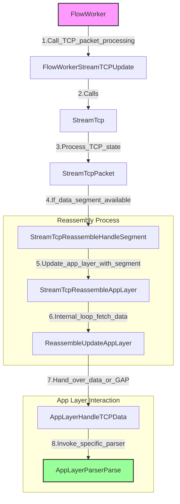

# Suricata 调用流程详解：从 FlowWorker 到 AppLayerParserParse

本流程图展示了从 `FlowWorker`（主数据包处理线程函数）到 `AppLayerParserParse`（应用层数据最终解析的地方）的执行路径，重点关注 TCP 流量。

## 详细步骤深度解析

### 1. `FlowWorker` (`src/flow-worker.c`)
*   **角色**：数据包处理流水线的主入口（Worker Thread）。
*   **逻辑**：
    *   它首先处理数据包的预处理和流查找 (`FlowHandlePacket`)。
    *   如果数据包是 TCP 协议并且关联了一个 Flow，它会进入 TCP 处理分支。
    *   **关键调用**：`FlowWorkerStreamTCPUpdate(tv, fw, p, det_ctx, false);`

### 2. `FlowWorkerStreamTCPUpdate` (`src/flow-worker.c`)
*   **角色**：TCP 流引擎的协调者。
*   **逻辑**：
    *   它负责启动 TCP 流处理的性能分析 (`PROFILE_FLOWWORKER_STREAM`)。
    *   它执行核心的 TCP 处理逻辑。
    *   处理完 TCP 后，它还会检查是否有“伪包”（Pseudo Packets）在处理过程中生成（例如用于 flushing 的伪包），并将它们送入检测引擎。
    *   **关键调用**：`StreamTcp(tv, p, fw->stream_thread, &fw->pq);`

### 3. `StreamTcp` (`src/stream-tcp.c`)
*   **角色**：TCP 模块的入口封装。
*   **逻辑**：
    *   它主要负责获取线程本地的 TCP 上下文 (`StreamTcpThread`)。
    *   它会对数据包进行基本的校验。
    *   **关键调用**：`StreamTcpPacket(tv, p, stt, pq);`

### 4. `StreamTcpPacket` (`src/stream-tcp.c`)
*   **角色**：TCP 状态机与核心逻辑处理。
*   **逻辑**：
    *   **状态维护**：根据 TCP 标志位（SYN, ACK, FIN, RST）更新流的状态（`ssn->state`），例如从 `SYN_SENT` 变为 `ESTABLISHED`。
    *   **数据处理**：如果数据包包含 Payload（载荷），或者虽然没有 Payload 但其序列号变化（如 SYN/FIN）影响了重组窗口，它会尝试处理这些数据。
    *   **乱序/重叠检查**：它会判断数据包是否在滑动窗口内。
    *   **关键路径**：如果数据包包含有效数据且流状态正常，进入重组逻辑。
    *   **关键调用**：`StreamTcpReassembleHandleSegment(tv, stt->ra_ctx, ssn, &ssn->client/server, p);`

### 5. `StreamTcpReassembleHandleSegment` (`src/stream-tcp-reassemble.c`)
*   **角色**：TCP 分段（Segment）管理。
*   **逻辑**：
    *   **插入缓冲区**：它将当前数据包的 payload 插入到 `StreamingBuffer`（红黑树）中。如果数据是乱序的，它会暂存；如果是重叠的，它会进行裁剪或合并。
    *   **触发应用层**：一旦数据成功放入缓冲区（无论是否连续），它都会尝试去驱动应用层解析器，看看是否有新的**连续**数据可供消费。
    *   **关键调用**：`StreamTcpReassembleAppLayer(tv, ra_ctx, ssn, stream, p, app_update_dir);`

### 6. `StreamTcpReassembleAppLayer` (`src/stream-tcp-reassemble.c`)
*   **角色**：应用层更新的包装器/桥梁。
*   **逻辑**：
    *   **检查开关**：它会检查 `STREAMTCP_FLAG_APP_LAYER_DISABLED`（应用层解析是否被禁用）或 `STREAMTCP_STREAM_FLAG_NOREASSEMBLY`（是否停止重组）。
    *   如果一切正常，它直接调用核心工作函数。
    *   **关键调用**：`ReassembleUpdateAppLayer(tv, ra_ctx, ssn, &stream, p, app_update_dir);`

### 7. `ReassembleUpdateAppLayer` (`src/stream-tcp-reassemble.c`)
*   **角色**：**数据投递的核心循环 (The Loop)**。
*   **逻辑**：
    *   **循环 (`while(1)`)**：它在一个循环中不断尝试从缓冲区获取数据，直到没有更多连续数据为止。
    *   **获取数据 (`GetAppBuffer`)**：根据当前的 `STREAM_APP_PROGRESS`（应用层已读到的位置），去缓冲区里找下一块数据。
    *   **ACK 确认 (`AdjustToAcked`)**：**重要！** 它通常只提取已经被 TCP ACK 确认过的数据（除非是 Async 模式）。
    *   **GAP 处理 (`CheckGap`)**：如果 `GetAppBuffer` 没找到数据，但 `last_ack` 已经越过了当前进度，它会判定为 **GAP**（丢包）。
        *   如果是 GAP，它会构造一个“空”的数据块，标记为 `STREAM_GAP`。
    *   **投递**：将找到的真实数据块（或者 GAP 信号）传给应用层。
    *   **进度更新**：如果应用层成功处理了数据，更新 `app_progress`，循环继续。
    *   **关键调用**：`AppLayerHandleTCPData(..., data, data_len, flags, ...);`

### 8. `AppLayerHandleTCPData` (`src/app-layer.c`)
*   **角色**：应用层协议处理的通用接口（多态入口）。
*   **逻辑**：
    *   **协议探测 (`TCPProtoDetect`)**：如果流的协议还未知 (`ALPROTO_UNKNOWN`)，它会将数据先送给探测引擎。如果探测成功，初始化对应的解析器状态。
    *   **调用解析器**：如果协议已知（例如 HTTP, TLS），它会根据协议类型（`alproto`）在函数指针数组中找到对应的 `Parse` 函数。
    *   **关键调用**：`AppLayerParserParse(tv, tctx->alp_tctx, f, f->alproto, ...);`

### 9. `AppLayerParserParse` (`src/app-layer-parser.c`)
*   **角色**：特定协议解析的调度器。
*   **逻辑**：
    *   它最终调用具体协议插件提供的解析函数（例如 `HTTPParserParse` 或 `TLSParserParse`）。
    *   解析器会消费数据，更新内部状态机（如 HTTP State Machine），提取事务信息（Transaction），并可能触发应用层事件（App Layer Events）。
